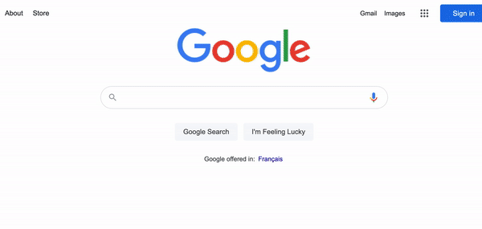

# 🐭 Fake browser, headless browser, all for bots 🤖

* **Basic version:**
Based on [puppeteer](https://github.com/puppeteer/puppeteer), uses JavaScript hooks to modify properties and provides a simple api to make your web bot undetectable.
* **Advanced version:**
[fakechrome](https://github.com/kkoooqq/fakechrome) recompiled Chromium to complete the simulation more thoroughly. 

------

😎 Join Discord [**ALL-FOR-BOTS**](https://discord.gg/VMUhnUe2) and let's discover fun things together!

------

Reverse engineering is not easy, and I would appreciate if you could give a ⭐!

------

## Technical details

FakeBrowser automatic login demo:


* Using [dumpDD.js](script/dumpDD.js) to collect fingerprint from real users.
* Writing [evasions](https://github.com/kkoooqq/fakebrowser/tree/main/src/plugins/evasions)😈 based on [puppeteer-extra](https://github.com/berstend/puppeteer-extra) to simulate the above fingerprints and bypass anti-bot detection.
* Provide [toolkit](src/core/FakeUserAction.ts) to simulate real user's mouse and keyboard operations.
* [Deploy to Linux](https://github.com/kkoooqq/fakebrowser/tree/main/script) and use Chrome / Edge in headless to **SAVE COST**. Chromium is not recommended because it lacks features such as MP4 support.

----

## Getting Started

### Installation

To use FakeBrowser in your project, run:

```bash
yarn add puppeteer axios fakebrowser
```

---

### Usage

#### ✅ Demo1: Quick Start

``` javascript
// cjs
const {FakeBrowser} = require('fakebrowser');

// esm
// import {FakeBrowser} from 'fakebrowser';
// import {createRequire} from 'module';
// const require = createRequire(import.meta.url);

!(async () => {
    // [Optional]: Select a fake device description
    const windowsDD = require('./node_modules/fakebrowser/device-hub/Windows.json');

    const builder = new FakeBrowser.Builder()
        // [Optional]: Set the fake device description
        .deviceDescriptor(windowsDD)
        // [Optional]: Show user action layers
        .displayUserActionLayer(true)
        // [Optional]: Set startup options (https://pptr.dev/#?product=Puppeteer&show=api-puppeteerlaunchoptions)
        .vanillaLaunchOptions({
            headless: false,
            executablePath: '/Applications/Google Chrome 93.0.4577.82.app/Contents/MacOS/Google Chrome',
        })
        // Must be set: path to save user data
        // We will create a fake device description (fake browser fingerprint) and save the browser's user cache information to this folder.
        // Note: Once the fake browser fingerprint is created, it will not change, just like a normal user using the browser.
        // If you want to get a different browser fingerprint, see demo2.
        .userDataDir('./fakeBrowserUserData');

    const fakeBrowser = await builder.launch();

    // vanillaBrowser is a puppeteer.Browser object
    const page = await fakeBrowser.vanillaBrowser.newPage();
    await page.goto('https://abrahamjuliot.github.io/creepjs/');
    
    // ***** Do something automatic *****
    
    // Don't forget to close your browser to release resources
    await fakeBrowser.shutdown();
})();
```

---

#### ✅ Demo2: Create fake different browser fingerprints.

There are two ways:
* [demo2-diff-fp1.js](demo/demo2-diff-fp1.js) Create multiple instances of FakeBrowser and set userDataDir to different folders.
* [demo2-diff-fp2.js](demo/demo2-diff-fp2.js) Create FakeBrowser instances with different DeviceDescriptor (retrieved from [device-hub](device-hub)).
* Too few device descriptions in device-hub? Please use [dumpDD.js](script/dumpDD.js) to crawl the real user's fingerprint by yourself 😜.

---

#### ✅ Demo3: Simulate complex actions like a real user.

Some websites track user mouse movements and listen for keyup events of fn keys. FakeBrowser provides easy-to-use toolkit to help you simulate real users.

[demo3-fake-user-action.js](demo/demo3-fake-user-action.js), I have written very detailed comments.



---

#### ✅ Demo4: Proxy support.

[demo4-proxy.js](demo/demo4-proxy.js), Support socks5, http, https proxy.

----

## 🐱 Bot / Fingerprint detection sites 

These pages use many fingerprinting techniques to detect if the browser is crawler software.

Results of running FakeBrowser on **CentOS 7.9**, **Headless Chrome 93.0.4577.82**, **Socks5 proxy** under AWS VPS:


| Test page | Notes | Result |
| ------ | ------ | ------ |
| [fingerprintjs](https://fingerprintjs.github.io/fingerprintjs/) | The basic fingerprint detection is easy to bypass. Even with the [pro version](https://fingerprintjs.com/demo/), FakeBrowser is able to cheat easily. |  [🔍](doc/test-result-fingerprintjs.png) |
| [creepjs](https://abrahamjuliot.github.io/creepjs/) | Contains lots of advanced detection methods, bypassing it took me a lot of time, but he provides source code, thanks to the author. It uses Worker, ServiceWorker to detect at the same time, and FakeBrowser is perfectly bypassed. |  [🔍](doc/test-result-creepjs.png) |
| [pixelscan](https://pixelscan.net) | JS code is obfuscated and can only be restored through the AST tree. The vulnerability is the detection process submits results to server, and we can reverse their analysis process based on the results. It detects if the browser font matches the system in UserAgent. FakeBrowser emulates fonts in 4 ways to bypass the detection perfectly. |  [🔍](doc/test-result-pixelscan.png) |
| [amiunique](https://amiunique.org/fp) | - |  [🔍](doc/test-result-amiunique.jpg) |
| [browser-fingerprinting](https://niespodd.github.io/browser-fingerprinting) | This author is also working on anti-anti-bot systems, and I learned lots of knowledge from his repository, thank you very much! |  [🔍](doc/test-result-niespodd.jpg) |
| [coveryourtracks](https://coveryourtracks.eff.org/) | This site detects if your canvas/webgl fingerprint is stable by refreshing the page to check if you are a real environment. In fact, simply adding noise to canvas is not enough, undrawn rectangular areas are easily detected if they have noise. FakeBrowser uses an edge detection method that only adds noise to drawn edges of text, circles, ellipses. |  [🔍](doc/test-result-coveryourtracks.png) |
| [f.vision](http://f.vision/) | - |  [🔍](doc/test-result-f.vision.png) |
| [recaptcha-test](https://antcpt.com/eng/information/demo-form/recaptcha-3-test-score.html) | Detects how many points your browser scores in reCaptcha. |  [🔍](doc/test-result-recaptcha.jpg) |
| [deviceinfo](https://www.deviceinfo.me) | - |  |
| [hackability](https://portswigger-labs.net/hackability/) | - | - |
| [sannysoft](https://bot.sannysoft.com/) | No pressure to bypass. |  [🔍](doc/test-result-sannysoft.jpg) |
| [incolumitas](https://bot.incolumitas.com) | This guy also collects lots of bot detection methods, and his blog contains advanced methods for proxy/VPN detection, recommended following. BTW: He uses puppeteer-extra-plugin-strealth's code bugs for bot detection, and there's nothing he can do if I fix those bugs. His test results are very unstable, with FakeBrowser often jumping between 0.8 and 1.0. Even a normal browser's score can drop to 0.5. |  [🔍](doc/test-result-incolumitas.png) |
| [antoinevastel](http://antoinevastel.com/bots) | Fingerprint detection page |  [🔍](doc/test-result-antoinevastel.jpg) |
| [browserleaks](https://browserleaks.com) | Everyone should know what this site is |  [🔍](doc/test-result-browserleaks.jpg) |
| [morellian](https://plaperdr.github.io/morellian-canvas/Prototype/webpage/picassauth.html) | - |  [🔍](doc/test-result-morellian.jpg) |
| [vytal.io](https://vytal.io) | - |  [🔍](doc/test-result-vytal.io.png) |
