     _______      _            ______                                          
    (_______)    | |          (____  \                                         
    _____  ____  | |  _  ____  ____)  )  ____  ___   _ _ _   ___   ____   ____
    |  ___)/ _  || | / )/ _  )|  __  (  / ___)/ _ \ | | | | /___) / _  ) / ___)
    | |   ( ( | || |< (( (/ / | |__)  )| |   | |_| || | | ||___ |( (/ / | |    
    |_|    \_||_||_| \_)\____)|______/ |_|    \___/  \____|(___/  \____)|_|

-----

# 🐭 Fake browser, headless browser, all for bots 🤖

* **Basic version:**
Based on [puppeteer](https://github.com/puppeteer/puppeteer), uses JavaScript hooks to modify properties and provides a simple api to make your web bot undetectable.
* **Advanced version:**
[fakechrome](https://github.com/kkoooqq/fakechrome) recompiled Chromium to complete the simulation more thoroughly. 

------

Reverse engineering is not easy, and I would appreciate if you could give a ⭐!

------

## Technical details

FakeBrowser automatic login demo:

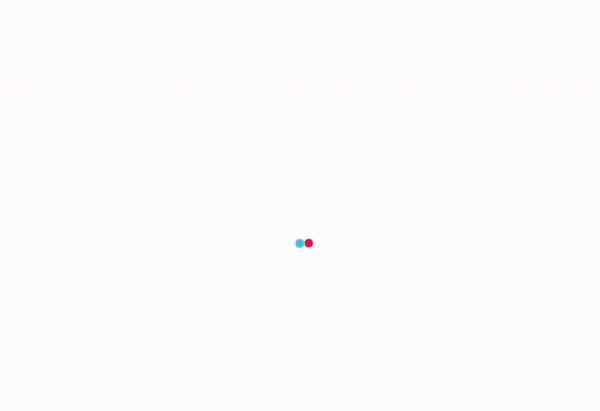

* Using [dumpDD.js](src/dumpDD.js) to collect fingerprint from real users.
* Writing [evasions](https://github.com/kkoooqq/fakebrowser/tree/main/src/plugins/evasions)😈 based on [puppeteer-extra](https://github.com/berstend/puppeteer-extra) to simulate the above fingerprints and bypass anti-bot detection.
* Provide toolkit API to simulate real user's mouse and keyboard operations.
* [Deploy to Linux](https://github.com/kkoooqq/fakebrowser/tree/main/script) and use Chrome/Edge in headless mode to **SAVE COST**. Reasons for not using Chromium: no support MP4 and few users using it.
* Captcha recognition from my another open source project: [anti-captcha](https://github.com/kkoooqq/anti-captcha).

----

## 🐱 Bot / Fingerprint detection sites 

These pages use many fingerprinting techniques to detect if the browser is crawler software.

Results of running FakeBrowser on **CentOS 7.9**, **Headless Chrome 93.0.4577.82**, **Socks5 proxy** under AWS VPS:

| Test page | Notes | Result |
| - | - | - |
| [fingerprintjs pro](https://fingerprintjs.github.io/fingerprintjs/) | The basic fingerprint detection is easy to bypass. Even with the pro version, FakeBrowser is able to cheat easily. | 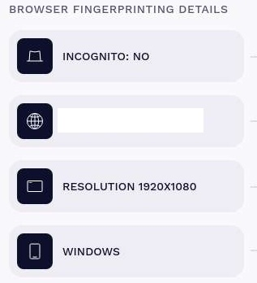 [🔍](doc/test-result-fingerprintjs.png) |
| [creepjs](https://abrahamjuliot.github.io/creepjs/) | Contains lots of advanced detection methods, bypassing it took me a lot of time, but he provides source code, thanks to the author. It uses Worker, ServiceWorker to detect at the same time, and FakeBrowser is perfectly bypassed. | 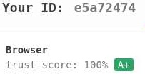 [🔍](doc/test-result-creepjs.png) |
| [pixelscan](https://pixelscan.net) | JS code is obfuscated and can only be restored through the AST tree. The vulnerability is the detection process submits results to server, and we can reverse their analysis process based on the results. It detects if the browser font matches the system in UserAgent. FakeBrowser emulates fonts in 4 ways to bypass the detection perfectly. |  [🔍](doc/test-result-pixelscan.png) |
| [amiunique](https://amiunique.org/fp) | - | 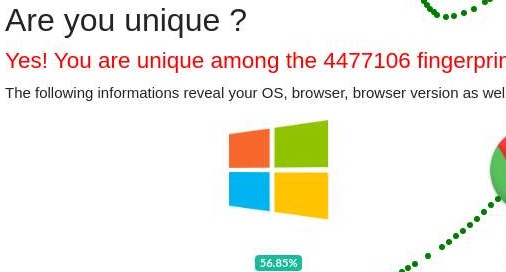 [🔍](doc/test-result-amiunique.jpg) |
| [browser-fingerprinting](https://niespodd.github.io/browser-fingerprinting) | This author is also working on anti-anti-bot systems, and I learned lots of knowledge from his repository, thank you very much! | 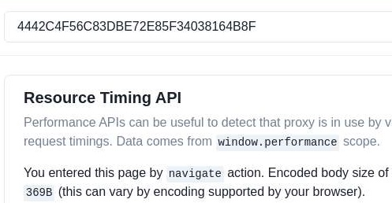 [🔍](doc/test-result-niespodd.jpg) |
| [coveryourtracks](https://coveryourtracks.eff.org/) | This site detects if your canvas/webgl fingerprint is stable by refreshing the page to check if you are a real environment. In fact, simply adding noise to canvas is not enough, undrawn rectangular areas are easily detected if they have noise. FakeBrowser uses an edge detection method that only adds noise to drawn edges of text, circles, ellipses. | 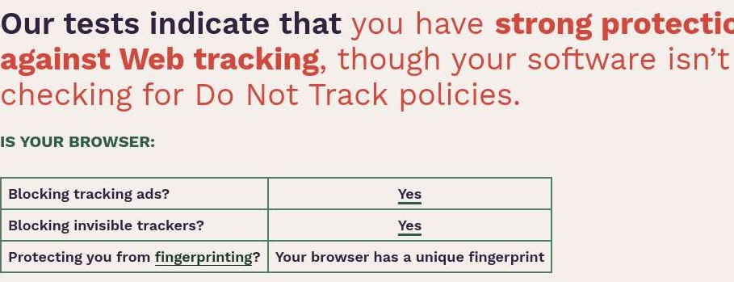 [🔍](doc/test-result-coveryourtracks.png) |
| [f.vision](http://f.vision/) | - | 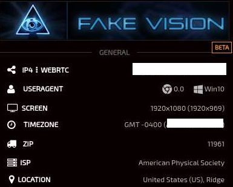 [🔍](doc/test-result-f.vision.png) |
| [recaptcha-test](https://antcpt.com/eng/information/demo-form/recaptcha-3-test-score.html) | Detects how many points your browser scores in reCaptcha. | 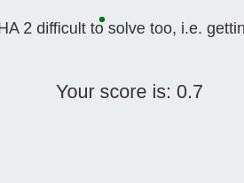 [🔍](doc/test-result-recaptcha.jpg) |
| [deviceinfo](https://www.deviceinfo.me) | - | 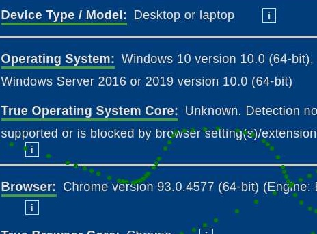 |
| [hackability](https://portswigger-labs.net/hackability/) | - | - |
| [sannysoft](https://bot.sannysoft.com/) | No pressure to bypass. | 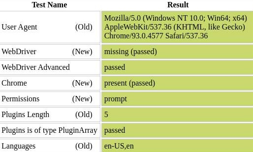 [🔍](doc/test-result-sannysoft.jpg) |
| [incolumitas](https://bot.incolumitas.com) | This guy also collects lots of bot detection methods, and his blog contains advanced methods for proxy/VPN detection, recommended following. BTW: He uses puppeteer-extra-plugin-strealth's code bugs for bot detection, and there's nothing he can do if I fix those bugs. His test results are very unstable, with FakeBrowser often jumping between 0.8 and 1.0. Even a normal browser's score can drop to 0.5. | 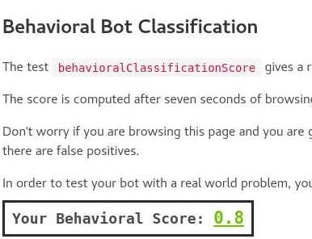 [🔍](doc/test-result-incolumitas.png) |
| [antoinevastel](http://antoinevastel.com/bots) | Fingerprint detection page | 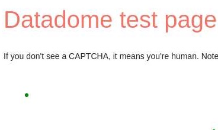 [🔍](doc/test-result-antoinevastel.jpg) |
| [browserleaks](https://browserleaks.com) | Everyone should know what this site is | 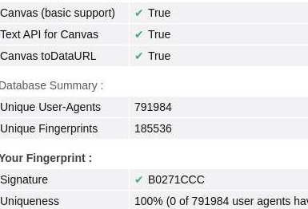 [🔍](doc/test-result-browserleaks.jpg) |
| [morellian](https://plaperdr.github.io/morellian-canvas/Prototype/webpage/picassauth.html) | - | 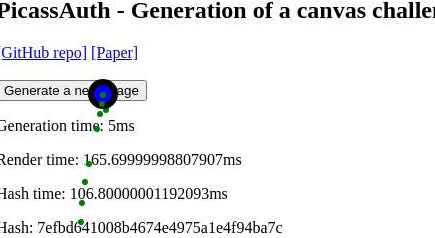 [🔍](doc/test-result-morellian.jpg) |
| [vytal.io](https://vytal.io) | - | 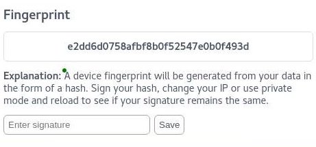 [🔍](doc/test-result-vytal.io.png) |
